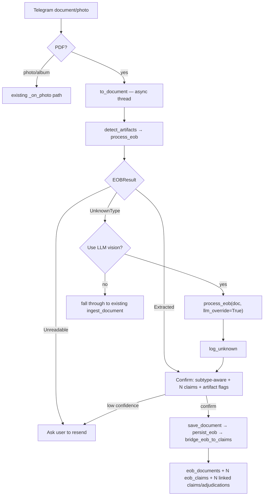

# Roadmap: EOB Extraction — Anthem v1 (Consolidated)

**Goal:** A user sends an Anthem EOB PDF to Luigi; it's OCR'd locally, extracted deterministically via a per-insurer profile (LLM only on explicit consent for unknown issuers), validated, confirmed subtype-aware, persisted append-only to `eob_*`, and bridged into the existing `claims`/`adjudications` lifecycle so `/balance` reflects it.
**Depends on:** Shipped medical pipeline — Sprint 1 (Phases 1–8: entities, claims/adjudication, documents/payments, confirmation, obligation views, alerts) + Sprint 2 Phases 9–13 (scanned-PDF raster + Poppler, correction loop, layout learning, claim matching, extractor dispatch scaffold + eval harness). Supersedes `roadmap_eob_extraction.md` (folded in) and replaces Sprint 2 Phases 14–15 with the component engine.
**Estimated scope:** Weeks (5 phases)
**Status:** Not started
**Last updated:** June 4, 2026

---

## Contracts (single source of truth)

`process_eob` does **no user I/O** — it returns a tagged result; the Telegram harness owns all prompting and owns `to_document` so the consent path reuses the same OCR'd doc (no re-OCR). One EOB **document** contains **many claims**, so extraction returns an `EOBDocument`. Extraction is **component-level and per-insurer**: each insurer is one `IssuerProfile` plugged into shared mechanisms (`segment`, `parse_table`, generic `ProfileExtractor`). **Adding an insurer = adding a profile** — no engine changes. Issuer is the only routing key; form version and subtype are profile-detected, not routes.

Persistence is **append-only / no dedup** (`eob_*` is canonical for rich EOB capture), and a **thin always-insert bridge** mirrors each claim into the shipped `claims`/`adjudications` lifecycle (`eob_claims.claim_id` FK) so obligation views keep working. The bridge never matches or supersedes.

```python
# src/medical/eob/types.py — PUBLIC contract
from dataclasses import dataclass
from enum import Enum
from typing import Protocol, Literal

class PdfKind(Enum):
    TEXT    = "text"      # USABLE embedded text layer → native word boxes
    IMAGE   = "image"     # image-only OR garbage text layer → OCR
    MIXED   = "mixed"     # some pages each
    NOT_PDF = "not_pdf"

@dataclass(frozen=True)
class Word:
    text: str
    x0: int; y0: int; x1: int; y1: int   # bbox → positional column bucketing
    page: int

@dataclass(frozen=True)
class Document:                            # OCR/normalized INPUT artifact (not the parsed EOB)
    text: str
    words: list[Word]
    page_images: list[bytes]              # PNG per page; retained for the LLM fallback
    source: PdfKind                       # how text was obtained → feeds validate() confidence

@dataclass(frozen=True)
class LineItem:
    service_date: str; service: str; reason_code: str   # ADU/033/015/A0/A1 carry meaning
    doctor_charges: str; discounts: str; allowed: str; anthem_paid: str
    copay: str; deductible: str; coinsurance: str; not_covered: str; your_total: str

@dataclass(frozen=True)
class Claim:
    patient: str                          # may differ from the document subscriber
    claim_number: str
    received_date: str | None
    provider: str
    in_network: bool
    patient_owes: str
    line_items: list[LineItem]

EOBSubtype = Literal["summary", "denial", "payment_notice", "duplicate_notice"]

@dataclass(frozen=True)
class EOBDocument:                         # the parsed EOB — the unit extraction returns
    issuer: str                           # "anthem"
    subtype: EOBSubtype
    subscriber: str
    claims: list[Claim]

@dataclass(frozen=True)
class ValidationResult:
    ok: bool; confidence: float; issues: list[str]

@dataclass(frozen=True)
class Extracted:   eob: EOBDocument; validation: ValidationResult; extractor: str
@dataclass(frozen=True)
class UnknownType: doc: Document
@dataclass(frozen=True)
class Unreadable:  reason: str
type EOBResult = Extracted | UnknownType | Unreadable

class Extractor(Protocol):                 # AnthemExtractor + LLM both satisfy this
    def extract(self, doc: Document) -> EOBDocument: ...
```

```python
# src/medical/eob/pipeline.py — flat guard-clause returns
def process_eob(doc: Document, *, llm_override: bool = False) -> EOBResult:
    if not doc.text.strip():
        return Unreadable("no legible text")
    issuer = identify(doc)                  # issuer only — form version does not route
    if issuer is not None:                  # known → specialist, regardless of flag
        eob = REGISTRY[issuer].extract(doc)
        return Extracted(eob, validate(eob, doc.source), extractor=issuer)
    if llm_override:                        # unknown → vision fallback (bypasses segmentation)
        eob = LLM_EXTRACTOR.extract(doc)
        return Extracted(eob, validate(eob, doc.source), extractor="llm")
    return UnknownType(doc)                  # unknown, no consent → harness asks

REGISTRY: dict[str, Extractor] = {"anthem": ProfileExtractor(ANTHEM_PROFILE)}  # add insurers here
```

```python
# src/medical/eob/bridge.py — EOBDocument → shipped claims/adjudications lifecycle.
# Always-insert (no dedup): never calls find_by_match_key / the Phase-12 link path.
def bridge_eob_to_claims(eob: EOBDocument, db_path: str, eob_document_id: int) -> list[int]:
    # per Claim:
    #   provider_id  = match_provider(...) or create_provider(...)              # reuse Phase 7
    #   practice_id  = resolve_entity_to_practice(provider) or create_practice  # reuse Phase 1
    #   encounter_id = find_or_create_encounter(service_date, practice_id)      # reuse Phase 6
    #   billed = sum(li.doctor_charges); allowed = sum(li.allowed)
    #   plan_paid = sum(li.anthem_paid); member_owed = claim.patient_owes
    #   claim_id = create_claim(..., encounter_id, billing_practice_id, billed) # reuse Phase 2
    #   adjudicate_claim(claim_id, received_date, allowed, plan_paid, member_owed)
    #   backfill eob_claims.claim_id = claim_id
    # returns created claim_ids
    ...
```

```sql
-- src/database.py — added to each per-user data/{chat_id}.db init_db() (no separate DB)
CREATE TABLE IF NOT EXISTS eob_documents (
    id                 INTEGER PRIMARY KEY AUTOINCREMENT,
    issuer             TEXT NOT NULL,
    subtype            TEXT NOT NULL,                         -- summary|denial|payment_notice|duplicate_notice
    subscriber         TEXT,
    source             TEXT NOT NULL,                         -- PdfKind: text|image|mixed
    extractor          TEXT NOT NULL,                         -- "anthem"|"llm"
    source_document_id INTEGER REFERENCES documents(id),      -- the stored PDF (Sprint 1 Phase 3 table)
    processed_at       DATETIME DEFAULT CURRENT_TIMESTAMP
);
CREATE TABLE IF NOT EXISTS eob_claims (
    id              INTEGER PRIMARY KEY AUTOINCREMENT,
    document_id     INTEGER NOT NULL REFERENCES eob_documents(id),
    claim_id        INTEGER REFERENCES claims(id),            -- bridge link (nullable; always-insert)
    claim_number    TEXT NOT NULL,                            -- indexed, NOT unique (resends → versions)
    patient         TEXT,
    provider        TEXT,
    in_network      BOOLEAN,
    received_date   DATE,
    patient_owes    TEXT,
    line_items_json TEXT
);
CREATE INDEX IF NOT EXISTS idx_eob_claim_number ON eob_claims(claim_number);
```

## Runtime flow



---

## Phase 1: Classify → OCR → canonical `Document`
**What's true when this is done:** `classify_pdf` labels a PDF TEXT/IMAGE/MIXED/NOT_PDF via a text-*quality* gate (Anthem's garbage layer → IMAGE); `to_document` normalizes either path into the same `Document`; `detect_artifacts` flags checks/EOP/out-of-order pages. A clean text PDF and an image PDF produce identical-shape output.

- [x] Add `pymupdf`, `pytesseract`, `Pillow` to `requirements.txt`; add `tesseract-ocr` to VPS provisioning + `deploy/luigi.service` notes (Poppler already added in Phase 9)
- [x] Create `src/medical/eob/__init__.py`; define all public types in `src/medical/eob/types.py` (`PdfKind`, `Word`, `Document`, `LineItem`, `Claim`, `EOBDocument`, `EOBSubtype`, `ValidationResult`, tagged `EOBResult`, `Extractor`)
- [x] Implement `classify_pdf` in `src/medical/eob/classify.py` with a per-page text-quality gate (alpha-ratio + expected-anchor check); usable → TEXT, garbage/empty → IMAGE, mix → MIXED, parse failure → NOT_PDF
- [x] Implement `detect_artifacts(doc) -> list[str]` (check/EOP/ACH/out-of-order/multi_doc) — detect only, no segmentation in v1
- [x] Implement `from_text_layer` (`fitz get_text("words")`), `from_ocr` (300 DPI + `image_to_data`), and the `to_document` orchestrator in `src/medical/eob/document.py`; raise `NotAPdf` on NOT_PDF
- [x] Write `tests/test_eob_classify.py` + `tests/test_eob_document.py`: Anthem image samples classify IMAGE despite ~2k garbage chars; clean Cigna → TEXT with native bboxes; non-PDF → NOT_PDF; `detect_artifacts` flags the Cigna check/EOP; both paths yield identical-shape `Document`

### Handoff — Phase 1
**Completed:** 2026-06-04
**Branch:** main
**Tests:** `pytest tests/ -x -q` — 273 passed, 0 failed

#### What was built
`src/medical/eob/` is the canonical EOB front door: `classify_pdf(bytes) -> PdfKind` uses a per-page text-quality gate (alpha-ratio + anchor-phrase rescue) that correctly routes Anthem's garbage text layer to OCR; `to_document(bytes) -> Document` normalises both text-layer and OCR paths into an identical frozen-dataclass `Document`; `detect_artifacts(doc) -> list[str]` flags embedded checks, EOP remittances, ACH notices, out-of-order pages, and multi-document concatenations. The insurer phrase map was relocated from `extraction.py` to the new `anchors.py` single source of truth.

#### Files changed
- **`src/medical/eob/__init__.py`** — package marker
- **`src/medical/eob/types.py`** — full public type contract (frozen dataclasses, `PdfKind` Enum, `Extractor` Protocol, `type EOBResult` PEP 695 union; requires Python 3.12+)
- **`src/medical/eob/anchors.py`** — `_INSURER_PHRASE_MAP` (shared) + `ANCHOR_PHRASES`; extraction.py now imports from here
- **`src/medical/eob/classify.py`** — `classify_pdf` + `_alpha_ratio`/`_has_expected_anchor`/`_page_is_usable`; never raises
- **`src/medical/eob/document.py`** — `from_text_layer` (fitz, 150 DPI page PNGs), `from_ocr` (300 DPI, graceful Tesseract-missing degrade), `to_document` orchestrator, `NotAPdf`
- **`src/medical/eob/artifacts.py`** — `detect_artifacts` with five private predicates; never raises
- **`tests/test_eob_classify.py`** — 10 tests including self-validating garbage-layer→IMAGE case
- **`tests/test_eob_document.py`** — 16 tests (both paths, DPI dimension check, graceful degrade, artifact flags)
- **`src/medical/extraction.py`** — replaced literal `_INSURER_PHRASE_MAP` with import from `eob.anchors`
- **`requirements.txt`** — added `pymupdf>=1.24.0`, `pytesseract>=0.3.10`, Python ≥3.12 note
- **`README.md`** — added system-dep install steps (poppler + tesseract) to both install sections
- **`deploy/luigi.service`** — added prerequisite system-packages comment block

#### How to verify manually
```python
# With pymupdf installed (no tesseract needed for text PDFs):
from src.medical.eob.document import to_document
from src.medical.eob.classify import classify_pdf
from src.medical.eob.artifacts import detect_artifacts

data = open("/Users/jgfrussell/Git/luigi-docs/EOBs/anthem EOB denial.pdf", "rb").read()
print(classify_pdf(data))          # PdfKind.IMAGE (garbage text layer)
# to_document requires tesseract installed: brew install tesseract
doc = to_document(data)
print(doc.source, len(doc.words), len(doc.page_images))
print(detect_artifacts(doc))       # expect ["check"] or [] depending on EOB type

# Cigna (clean TEXT):
data2 = open("/Users/jgfrussell/Git/luigi-docs/EOBs/cigna/eob may 17.pdf", "rb").read()
print(classify_pdf(data2))         # PdfKind.TEXT
doc2 = to_document(data2)          # no tesseract needed on TEXT path
print(doc2.source, len(doc2.words))
```

#### Open questions / deferred decisions for Phase 2
- **Thresholds unvalidated against real Anthem PDFs**: `MIN_ALPHA_RATIO=0.55` and `MIN_USABLE_CHARS=50` are synthetic-fixture estimates; tune against `/Users/jgfrussell/Git/luigi-docs/EOBs` once tesseract is installed locally.
- **MIXED handling**: MIXED PDFs are treated as IMAGE (full-document OCR) and stamped `source=IMAGE`; per-page hybrid merge (text for text pages, OCR for image pages) is deferred.
- **Tesseract not on VPS**: known blocker; until installed, Anthem EOBs will surface as `Unreadable` via the graceful degrade path. See `deploy/luigi.service` comment and README.
- **page_images eager render on TEXT path**: rendered at 150 DPI for identical-shape + future LLM fallback; if memory is a concern on very long documents, lazy rendering is the Phase 3 alternative.

---

## Phase 2: Deterministic Anthem extraction — engine + profile + gate
**What's true when this is done:** `process_eob` returns a correct `EOBDocument` for the Anthem fixtures (1 / ~12 / 2 claims; subtype summary/denial/payment_notice; tables stitched across pages; `subscriber != claims[0].patient`); `ANTHEM_PROFILE` clears ≥90% precision / N≥15 in `run_all_extractor_evals.py`; an unknown issuer returns `UnknownType`.

- [x] Implement `identify(doc) -> str | None` in `src/medical/eob/identify.py`: anchor on issuer name → issuer key (one key covers all Anthem form versions)
- [x] Implement the shared `segment(doc, signatures) -> list[Block]` engine (`blocks.py`) and the generic `parse_table(block, spec)` primitive (`tables.py`): header-derived column x-centers, nearest-column bucketing, stitch across `block.page_span`, stop at `row_terminator`
- [x] Implement the generic `ProfileExtractor` + `IssuerProfile`/`Signature`/`ColumnSpec` in `profiles/__init__.py`: segment → route → `pair_claims` → `assemble_claim` → `EOBDocument`; satisfies `Extractor`, carries no issuer-specific logic
- [x] Build `ANTHEM_PROFILE` in `profiles/anthem.py`: Anthem signatures, `ColumnSpec` (incl. the visually-separated magenta `your_total` anchor), block extractors (`claim_table` via `parse_table`; `claim_banner` → claim_number/received/doctor/patient/owes/in_network; `header` → subscriber; `doc_banner` → subtype); register `REGISTRY["anthem"]`
- [x] Implement `validate(eob, source)` in `validate.py`: per-claim arithmetic reconciliation (±$0.01); subtype-aware owe interpretation (denial/duplicate/payment_notice ≠ "you owe $X"); reason-code aware (ADU=pending, 033=filing-limit, A1=duplicate); higher confidence for `source TEXT`
- [x] Implement `process_eob` in `pipeline.py` per the contract (no LLM yet → unknown returns `UnknownType`)
- [ ] Run the dobby playbook against `ANTHEM_PROFILE`: annotate N≥15 samples under `experiments/medical/anthm_eob/`, wire `eval_anthm_eob.run_eval` into the existing `run_all_extractor_evals.py`, loop on failure modes (multi-page stitch, 2-digit years, $0.00 rows, sparse Totals miscount) until ≥90%, register the registry/allowlist entry
- [x] Write `tests/test_eob_extraction.py`: `parse_table` on the screenshot crop (all columns incl. narrow right-side + magenta total); multi-page stitch on the denial fixture; `segment` finds N banner+table pairs; subtype per fixture; claim counts 1/≈12/2; assert `ProfileExtractor` holds no Anthem-specific logic

### Handoff — Phase 2
**Completed:** 2026-06-05
**Branch:** main
**Tests:** `pytest tests/ -x -q` — 291 passed, 0 failed

#### What was built
The deterministic EOB extraction engine is complete: `identify()` in `anchors.py` maps issuer phrases → keys; `segment()` in `blocks.py` breaks a `Document` into typed `Block`s by sliding-window anchor detection; `parse_table()` in `tables.py` buckets words into named columns by nearest x-center and stitches across pages; `ProfileExtractor` in `profiles/__init__.py` orchestrates the full pipeline (zero Anthem-specific logic) with private `_pair_claims`/`_assemble_claim` helpers; `ANTHEM_PROFILE` in `profiles/anthem.py` wires up Anthem's four signatures, 12-column table spec, and block field parsers; `validate()` in `validate.py` runs per-claim arithmetic with subtype/reason-code awareness; `process_eob()` in `pipeline.py` is the public entry point. A critical cross-path fix was made: `from_text_layer` now scales fitz PDF-point coordinates to OCR-DPI pixels (`× 300/72`) so text-layer and OCR documents share one coordinate space for column bucketing. The insurer key `"anthm"` was renamed to `"anthem"` atomically across `anchors.py`, `extraction.py`, and `allowlist.py`.

#### Files changed
- **`src/medical/eob/anchors.py`** — key `"anthm"` → `"anthem"`; added public `identify(text)` function
- **`src/medical/eob/document.py`** — `from_text_layer` now scales coords to OCR-DPI pixels; added `OCR_DPI = 300` constant
- **`src/medical/eob/blocks.py`** *(new)* — `Block` frozen dataclass + `segment()` segmentation engine
- **`src/medical/eob/tables.py`** *(new)* — `parse_table()` nearest-column bucketing + multi-page stitching
- **`src/medical/eob/profiles/__init__.py`** *(new)* — `Signature`, `ColumnSpec`, `IssuerProfile`, `ProfileExtractor`
- **`src/medical/eob/profiles/anthem.py`** *(new)* — `ANTHEM_PROFILE` with 4 signatures, 12-column spec, 4 block extractors
- **`src/medical/eob/validate.py`** *(new)* — `validate()` + `_parse_amount()` helper
- **`src/medical/eob/pipeline.py`** *(new)* — `process_eob()` + `REGISTRY`
- **`src/medical/eob/__init__.py`** — exports `process_eob`, `REGISTRY`, `validate`
- **`src/medical/extraction.py`** — removed `_detect_insurer`; now imports `identify` from `anchors`
- **`src/medical/extractors/allowlist.py`** — comment added: insurer keys must match `_INSURER_PHRASE_MAP`
- **`src/medical/scripts/run_all_extractor_evals.py`** — comment noting where to register Anthem eval once N≥15 samples exist
- **`experiments/__init__.py`**, **`experiments/medical/__init__.py`**, **`experiments/medical/anthm_eob/__init__.py`** *(new)*
- **`experiments/medical/anthm_eob/annotations.csv`** *(new)* — header-only scaffold
- **`experiments/medical/anthm_eob/eval_anthm_eob.py`** *(new)* — `run_eval()` with vacuous-pass at n<15
- **`tests/test_eob_extraction.py`** *(new)* — 18 tests
- **`tests/test_medical_extraction.py`** — updated `"anthm"` → `"anthem"` key references

#### How to verify manually
```python
from src.medical.eob.document import to_document
from src.medical.eob.pipeline import process_eob
from src.medical.eob.types import Extracted

data = open("/Users/jgfrussell/Git/luigi-docs/EOBs/anthem EOB denial.pdf", "rb").read()
doc = to_document(data)           # requires tesseract installed locally
result = process_eob(doc)
assert isinstance(result, Extracted)
print(result.eob.subtype, len(result.eob.claims))
print(result.validation)
```

#### Open questions / deferred decisions for Phase 3
- **Column x-centers unvalidated**: `ANTHEM_PROFILE` column geometry is estimated at 300 DPI; claim field extraction (amounts, dates) will likely need tuning once real EOBs are run through `eval_anthm_eob.run_eval` with N≥15 verified samples. The eval scaffold is wired and ready — annotate `experiments/medical/anthm_eob/annotations.csv` then call `python -m experiments.medical.anthm_eob.eval_anthm_eob`.
- **Eval task remains open**: the dobby playbook / ≥90% precision gate checkbox is intentionally left unchecked — it requires real annotated EOB samples not available in CI. Wire into `run_all_extractor_evals.py` only after the precision bar is cleared locally.
- **LLM branch**: `process_eob(doc, llm_override=True)` raises `NotImplementedError` — Phase 3 delivers this.
- **`_extract_claim_banner` regex**: first-pass patterns; real Anthem formatting may require adjustment once tested against actual PDFs.

## Phase 3: LLM vision fallback + consent
**What's true when this is done:** an unknown-issuer EOB plus explicit user consent → `process_eob(doc, llm_override=True)` returns `Extracted` via the vision model with `extractor="llm"` and a populated `EOBDocument`; declining stops and logs; the unknown doc is flagged for a future profile. Consent is scoped to the EOB engine only — the existing bill/statement LLM path is unchanged.

- [ ] Add `LLM_VISION_MODEL` to `src/config.py`; reuse the existing OpenRouter client (verify image input via OpenRouter — Blockers)
- [ ] Implement `LLMVisionExtractor` in `src/medical/eob/extractors/llm.py` satisfying `Extractor`: send `page_images` + a prompt returning the `EOBDocument` shape (subtype, subscriber, claims); parse JSON → `EOBDocument`
- [ ] Wire `llm_override` into `process_eob` (unknown + override → `LLM_EXTRACTOR`, `extractor="llm"`)
- [ ] Implement `log_unknown(doc, result, db_path)` in `corpus.py`: flag the stored `documents` row as unknown-issuer and retain the `page_images` reference (reuse existing on-disk document storage — no separate PHI corpus)
- [ ] Write `tests/test_eob_llm.py`: override path on a non-Anthem (Cigna) fixture → `Extracted` with `extractor="llm"` (mock the API); `log_unknown` writes the expected flag

## Phase 4: Bridge persistence
**What's true when this is done:** a confirmed `EOBDocument` writes one `eob_documents` row + one `eob_claims` row per claim (append-only) AND inserts a linked `claims`+`adjudications` row per claim (always-insert, no dedup) with `eob_claims.claim_id` populated, so `v_claim_obligation` / `/balance` reflect the EOB. Two sends of the same `claim_number` produce two of each.

- [ ] Add `eob_documents` + `eob_claims` (schema above, incl. `claim_id` and `source_document_id` FKs) to `src/database.py` `init_db()`
- [ ] Implement `persist_eob(eob, source, extractor, source_document_id, db_path) -> int` in `src/medical/eob/persist.py`: INSERT the document row, then one `eob_claims` row per `Claim` (serialize `line_items` → JSON); return `eob_document_id`
- [ ] Implement `bridge_eob_to_claims(eob, db_path, eob_document_id) -> list[int]` in `bridge.py`: per claim derive billed/allowed/plan_paid by summing line items + member_owed from `patient_owes`; `match_provider`→`create_provider` (Phase 7); `resolve_entity_to_practice`→`create_practice` (Phase 1); find-or-create encounter (Phase 6); `create_claim`; `adjudicate_claim`; backfill `eob_claims.claim_id`. Never match/supersede
- [ ] Implement `get_latest_eob_claim` / `get_eob_claim_history` (join back to `eob_documents` for subtype/subscriber)
- [ ] Write `tests/test_eob_persist.py`: multi-claim → 1 doc + N `eob_claims` + N bridged `claims`; same `claim_number` twice → two of each (no dedup); `v_claim_obligation` reflects bridged amounts; latest-per-claim returns newest; subtype/subscriber round-trip

## Phase 5: Telegram vertical slice
**What's true when this is done:** a user sends an Anthem PDF → subtype-aware confirm listing each claim + artifact flags → on confirm, claims save via the bridge and show in `/balance`; an unknown EOB triggers the consent prompt; a declined/non-Anthem PDF falls through to the existing `ingest_document` pipeline; photos use the existing photo path.

- [ ] In `telegram_handler.py` `_on_document`: for PDFs run `await asyncio.to_thread(to_document, bytes)` → `detect_artifacts` → `process_eob`; branch on `EOBResult`
- [ ] Implement the subtype-aware confirm: render the `EOBDocument` ("$558.31 deposited to you" vs "denied — may owe $1,469.68 pending info" vs "you owe $X across N claims"), list each claim, surface artifact flags; reuse the existing pending-confirmation state + reply-parser; low confidence → ask resend
- [ ] On `confirm`: `save_document` the PDF → `persist_eob` → `bridge_eob_to_claims` (wrapped in `asyncio.to_thread`)
- [ ] Implement the `UnknownType` consent round-trip: prompt "Unknown EOB — use AI vision?"; yes → `process_eob(doc, llm_override=True)` → `log_unknown` → confirm; no → hand off to the existing `ingest_document` flow
- [ ] Route `Unreadable` / declined / non-EOB results to the existing `ingest_document` pipeline so bills/statements/receipts/photos/albums are unaffected
- [ ] Write `tests/test_eob_telegram.py`: PDF→extract→confirm-yes→persist+bridge (multi-claim, appears in `/balance`); unknown→consent→llm→persist; decline→falls through to `ingest_document`; artifact flag surfaced (mocked transport)

---

## Blockers & Open Questions
- [ ] **OpenRouter vision** — confirm the model string accepts image input for the fallback (gpt-4o-mini supports vision; verify via OpenRouter). Gates Phase 3
- [ ] **Tesseract on the VPS** — not yet installed; until it is, Anthem EOBs can't be OCR'd in prod and fall through to the LLM. Add to README + deploy scripts before Phase 1 ships (carryover from Sprint 2 Blockers)
- [ ] **Bridge practice mapping** — Anthem EOBs name a rendering doctor, not a billing practice. Decide whether `resolve_entity_to_practice(provider)` is sufficient or a placeholder practice is created per EOB. Affects Phase 4 `bridge_eob_to_claims`
- [ ] **EOB-vs-non-EOB for unknown issuers** — with only Anthem known, the `UnknownType` consent prompt could fire on a bill. Decide a heuristic gate vs. always-hand-off-on-decline. Affects Phase 5 routing
- [ ] **`log_unknown` retention** — corpus contains PHI at rest (incl. check/ACH financial data). Decide retention policy. Phase 3
- [ ] **Multi-document segmentation** (EOB + EOP + check in one PDF, pages out of order) is **detect-and-flag only** in v1 — full segmentation deferred
- [ ] **No-dedup consequence** — Phase 12's "possible duplicate / link" prompt and Phase 2 supersede chains are intentionally bypassed for EOBs (always-insert bridge); resends inflate obligation views by design

## Reference
- Superseded / folded in: `roadmap_eob_extraction.md`; replaces Sprint 2 Phases 14–15
- Shipped foundation: `roadmap_medical_bill_tracking.md` (Sprint 1), `roadmap_medical_sprint2.md` Phases 9–13 — dispatch scaffold, `run_all_extractor_evals.py`, dobby annotation playbook
- `product_requirements.md` — confirm-before-commit, two-call LLM separation, no-separate-DB
- `Coding Standards` — pytest per function, `logging` not prints, atomic commits
- Fixtures (`tests/fixtures/`): Anthem image single-claim; screenshot claim-table crop (`parse_table` unit); Anthem denial (~12 claims, multi-page stitch); Anthem payment_notice (2 claims); Cigna clean-TEXT (LLM-fallback target); Cigna MIXED/IMAGE (artifact flags)
